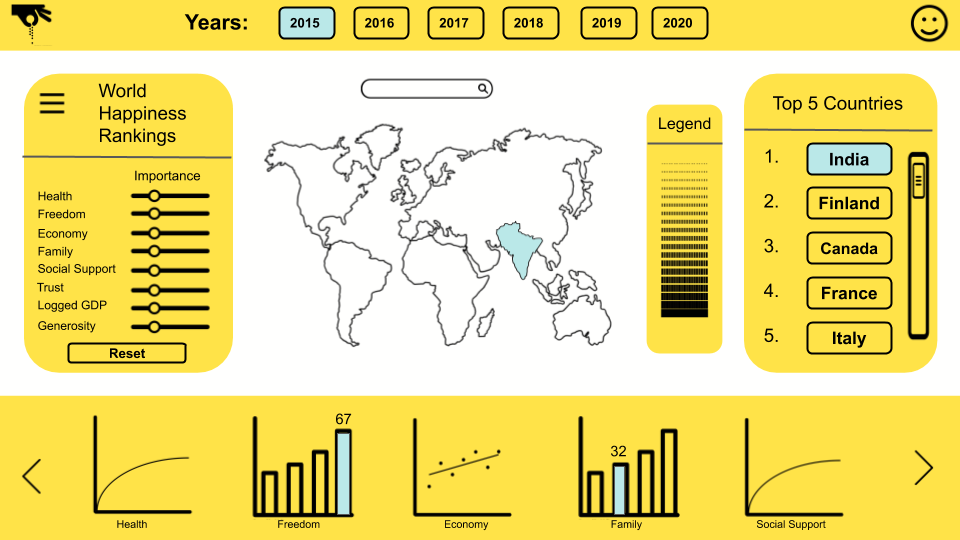
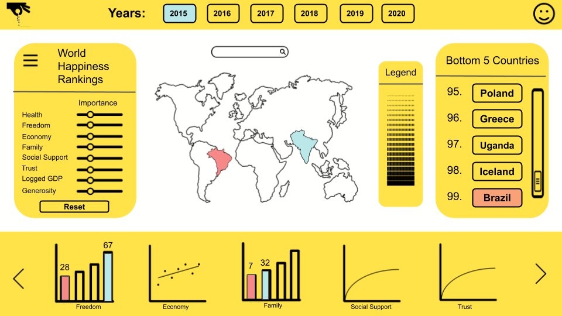

# Dash-of-Spice: Happiness Navigator

## Link to Dashboard
Please find our dashboard [here](https://happy-navvy.herokuapp.com/).

## App Description

The Happiness Navigator app dashboard is an interactive visual tool to help users navigate, filter, and compare the [results](https://www.kaggle.com/mathurinache/world-happiness-report) of the [World Happiness Report](https://en.wikipedia.org/wiki/World_Happiness_Report). The report is a survey of citizens from each of the 153 participating countries that attempts to quantify their overall happiness and quality of life over a range of metrics, and then combines this information into a single happiness score.

The main visual focus of the app is a navigable world map, that if no countries are selected uses a sequential color gradient and legend to indicate the happiness scores of each nation given the currently metric weights. If countries are selected by clicking or using the text input search dropdown, they are highlighted in different colours mapped by the legend. These results are summarized in the right panel with a scrollable list of all or selected countries sorted by score.

The collapsible user input panel on the left contains input sliders and dropdowns to weight each of the quality of life metrics between 0 and 100 to customize and update the combined happiness score relative to the users preferences. This panel also contains a year range selector to filter from which years to use survey data to see how scores are changing over time, or to limit data to only the most recent. Finally, this panel also includes reset button to restore all sliders and app inputs back to a fresh state.

On the bottom of the dashboard are a row of distribution plots for each quality of life metric. If no countries are selected, these will display density plots of each metric and annotations of key global parameters. If the user selects countries, these plots will transform to directly compare metrics between selections and global averages with bar charts.

## App Sketch

The initial dashboard showing the top 5 countries based on the user's ranking inputs:

>

The final dashboard showing the rankings of the rest of the countries and the bottom 5 countries after scrolling. Clicking on another country will highlight it with the top country, and clicking the arrows in the plots section will display different feature ranks.

## What are we doing?
At Dash of Spice, we aim to provide an easy-to-use application to individuals and families looking to immigrate to a country that aligns best with their values. Our dashboard utilizes a user's key values to suggest countries that would provide maximum happiness if they immigrated there.

### Aims
- Help facilitate decision making process for immigrants by comparing countries across the world
- Allow users to specify specific criteria (happiness, GDP per capita, freedom to make life choices, etc.) that are most important to them
- Display multiple visualizations to show specific criteria comparison for different countries and against a global average
- Provide an option for a user to view a year progression for specified countries

### Importance
With the stigma surrounding mental health slowly evaporating and more people are openly discussing their mental struggles and seeking help, there is an increased need for accessible information about achieving maximum happiness. All over the world, people are looking for new adventures and new beginnings in hopes to find a place they can call home. The immigration process can be complicated and difficult, especially with the fast changing pace of society. Our purpose is to help facilitate the decision making process for people wanting to immigrate to a new country.  

## Who are we?
At Dash of Spice, we are a team of data scientists working for an immigration consulting company. The founders of Dash of Spice - [Rachel](https://github.com/rachelywong), [Saule](https://github.com/Saule-Atymtayeva), [Chad](https://github.com/ChadNeald), and [Craig](https://github.com/cmmclaug) - are friends from the Master of Data Science program at The University of British Columbia. The development of Happy Navvy was made in part of the course DSCI 532 - Data Visualization II. 

## Come join us!
We are always looking for future improvements and additions. Specifically, we are hoping to integrate an algorithm that incorporates all user specified features to calculate the most accurate happiness ranking of suggested countries for users. 

If you are interested in joining us, please check out our [contribution file](https://github.com/UBC-MDS/dash_of_spice/blob/main/contribution_guidelines.md) for more information! 

