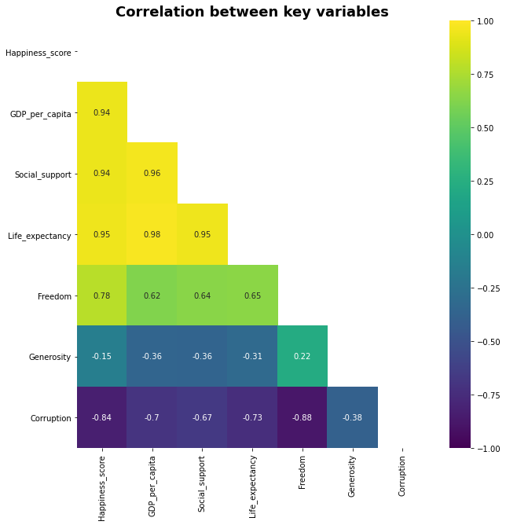

## Description of Data

The happiness rating data is presented for 2015-2020 with more than 150 countries for each year. To calculate `Happiness score`, the following **main** indicators are taken into account:

- GDP per capita
- Social support
- Healthy life expectancy
- Freedom to make life choices
- Generosity
- Perceptions of corruption.

The scores for these variables are based on both statistical data (e.g., `GDP per capita`, `Life expectancy`) and the results of public opinion surveys of residents in different countries about how happy they feel, conducted by the Gallup International Research Center, which ask respondents in each country to rate their feeling of happiness on a special scale.

To see the correlation between the key variables mentioned we have obtained the heatmap (Figure 1). The color palette in the side represents the amount of correlation among the variables in such a way that the lighter shade represents high correlation. According to the heatmap, the Happiness score is highly correlated with life expectancy, GDP per capita, and social support. Furthermore, it is least correlated with generosity and perceptions of corruption. It is surprising that the latter is not the principal reason for happiness in countries.
 

  
   
  <em>Figure 1. The correlation between the key variables</em>

 
 
Since `Life expectancy` is the highest correlated variable with `Happiness score`, the plot below show that the top 5 countries in the Happiness Ranking (Switzerland, Norway, Iceland, Denmark, and Finland) have the highest life expectancy. At the same time, with a reduction in the indicator of life expectancy, a decrease in the position in the rating is clearly visible. (Figure 2).
 
 

  
   
  <em>Figure 2. The dependence of happiness rank on life expectancy</em>

 