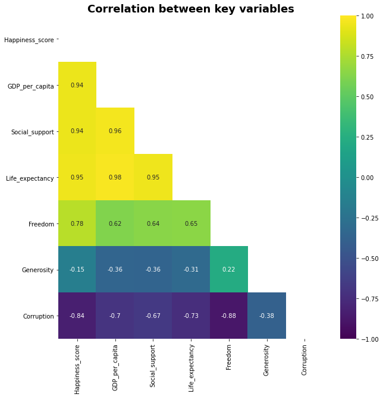
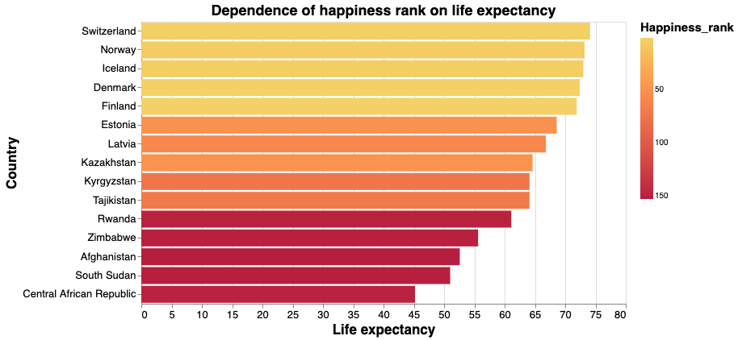

# Dash-of-Spice: Happiness Navigator Proposal

## Motivation and Purpose

Our Role: Data scientists working for an immigration consulting company

Target Audience: Families and individuals looking to move to a new
country.

The stigma surrounding mental health has been slowing evaporating over
the years as more and more people openly talk about their mental
struggles and seek help. Families want to raise their kids in a society
that promotes happiness, financial security, and a long life expectancy,
among other things. Our purpose is to help facilitate the decision
making process for people who wish to move to a new country by providing
them with an easy to use app that compares countries across the world.
We propose using the World Happiness Report as our data set to create
this app. Our intent is that an individual will be able to specify what
criteria (happiness, GDP per capita, freedom to make life choices, etc.)
are most important to them in their choice of a new country and then
display the most promising results coupled with interpretable graphs and
key values.

## Description of Data

The happiness rating data is presented for 2015-2020 with more than 150 countries for each year. To calculate `Happiness score`, the following **main** indicators are taken into account:

- GDP per capita
- Social support
- Healthy life expectancy
- Freedom to make life choices
- Generosity
- Perceptions of corruption.

The scores for these variables are based on both statistical data (e.g., `GDP per capita`, `Life expectancy`) and the results of public opinion surveys of residents in different countries about how happy they feel, conducted by the Gallup International Research Center, which ask respondents in each country to rate their feeling of happiness on a special scale.

To see the correlation between the key variables mentioned we have obtained the heatmap (Figure 1). The color palette in the side represents the amount of correlation among the variables in such a way that the lighter shade represents high correlation. According to the heatmap, the happiness score is highly correlated with life expectancy, GDP per capita, and social support. Furthermore, it is least correlated with generosity and perceptions of corruption. It is surprising that the latter is not the principal reason for happiness in countries.
 

  
   
  <em>Figure 1. The correlation between the key variables</em>

 
 
Since `Life expectancy` is the highest correlated variable with `Happiness score`, the plot below show that the top 5 countries in the Happiness Ranking (Switzerland, Norway, Iceland, Denmark, and Finland) have the highest life expectancy. At the same time, with a reduction in the indicator of life expectancy, a decrease in the position in the rating is clearly visible. (Figure 2).
 
 

  
   
  <em>Figure 2. The dependence of happiness rank on life expectancy</em>

## Research Questions and Usage Scenarios

### Questions
* Which countries report the highest and lowest quality of life metrics and overall happiness?
* Are there geographical patterns between specific quality of life indicators, and what do they suggest?
* Which quality of life metrics are the most important to you personally, and which countries best represent these values?
* How do specific countries compare to one another directly in quality of life metrics and overall happiness?

### Usage Scenario

Adam and Steve are refugees with a young family from the corrupt, poverty-stricken, and war-torn fictional nation of [Dystopia](https://en.wikipedia.org/wiki/World_Happiness_Report#International_rankings). They've managed to endure great personal hardship and have courageously escaped to an international aid camp where they are given the opportunity to choose any country in the world for asylum. To help make their decision, they are presented with the Happiness Navigator dashboard, which they use initially to [Educate] themselves about the relative happiness levels of countries around the world to supplement their poor Dystopian education. They are able to adjust the apps quality of life metric sliders to [Filter] and [Analyze] options for potential new homes that best align with their values and hopes for their childrens future. They can [Compare] their narrowed list of potential destinations directly against one another, and how each relates to the global population parameters for each metric using the distribution plots. Finally, they can control the dataset year ranges to view how the happiness of each country has evolved over the life of the dataset to [Infer] which countries might be ideal candidates for opportunity and future growth for their children's generation.